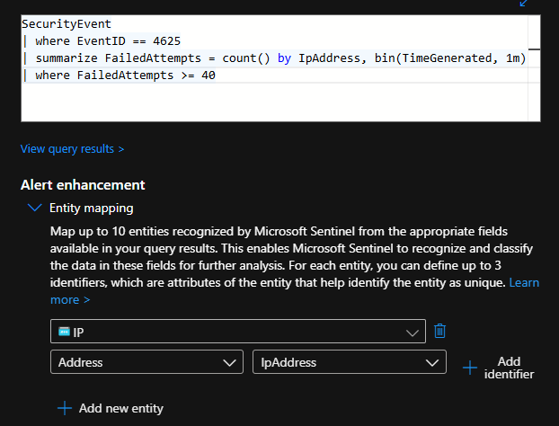
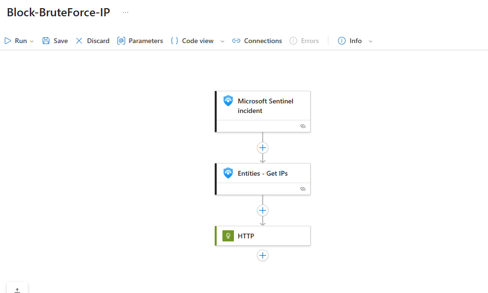
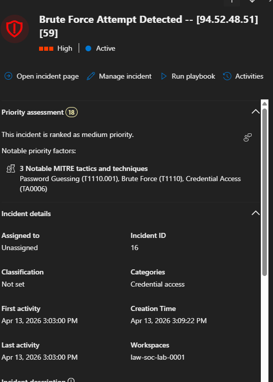
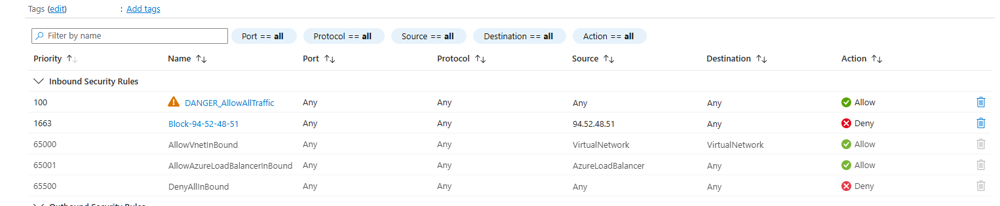

# ☁️ Azure Cloud SOC Lab — Live Honeypot with Microsoft Sentinel SIEM

## Objective

Built a cloud-based SOC environment in Microsoft Azure to ingest, analyze, and visualize real-world cyber attacks. Deployed a deliberately exposed Windows 10 VM as a honeypot, forwarded security logs to a Log Analytics Workspace, and connected Microsoft Sentinel (SIEM) to detect and map brute-force login attempts from across the globe — all using live attack data, not simulations.

---

## Architecture

```
Internet (Attackers)
        │
        ▼
┌──────────────────────────────────────────────────┐
│  Azure Resource Group                            │
│                                                  │
│  ┌─────────────────────────────────────────────┐ │
│  │  Virtual Network (VNet)                     │ │
│  │  ┌───────────────────────────────────────┐  │ │
│  │  │  Subnet                               │  │ │
│  │  │  ┌─────────────────────────────────┐  │  │ │
│  │  │  │  CORP-NET-WEST-1 (Honeypot VM)  │  │  │ │
│  │  │  │  Windows 10 Pro                 │  │  │ │
│  │  │  │  Host Firewall: Disabled        │  │  │ │
│  │  │  └─────────────────────────────────┘  │  │ │
│  │  └───────────────────────────────────────┘  │ │
│  └─────────────────────────────────────────────┘ │
│                                                  │
│  NSG (Network Security Group)                    │
│  Rule: Allow ALL inbound traffic                 │
│                                                  │
│  ┌──────────────────────┐   ┌─────────────────┐  │
│  │  Log Analytics       │──▶│  Microsoft      │  │
│  │  Workspace (LAW)     │   │  Sentinel       │  │
│  │                      │◀──│  (SIEM)         │  │
│  └──────────────────────┘   └─────────────────┘  │
│         ▲                                        │
│         │  Security Event Logs (via AMA)         │
│         └────────────────────────────────────────┘
```

---

## Technologies & Tools

- **Microsoft Azure** — Cloud platform (Free Tier, $200 credit)
- **Microsoft Sentinel** — Cloud-native SIEM for log ingestion, detection, and visualization
- **Log Analytics Workspace (LAW)** — Centralized log repository
- **Azure Virtual Machines** — Windows 10 honeypot (D2s size)
- **Network Security Groups (NSG)** — Cloud firewall configuration
- **KQL (Kusto Query Language)** — Log querying and threat hunting
- **Windows Event Viewer** — Local log analysis (Event ID 4625: Failed Logon)
- **Azure Monitor Agent (AMA)** — Log forwarding from VM to LAW
- **Azure Logic Apps** — Automated playbook execution for incident response

---

## Phase 1 — Infrastructure Deployment

### Resource Group & Networking
- Created a Resource Group to organize all cloud resources
- Deployed a Virtual Network (VNet) with a subnet for the honeypot VM
- Encountered a region availability issue with the desired VM size (D2s) — recreated the Resource Group and VNet in **US West** to resolve

### Honeypot VM Configuration
- Deployed a **Windows 10** VM named `CORP-NET-WEST-1` to appear as a legitimate corporate system to attackers
- Connected the VM to the existing VNet and subnet
- Disabled all Windows Firewall profiles on the VM to maximize attack surface


*All three firewall profiles (Domain, Private, Public) disabled on the honeypot VM.*

### NSG Firewall Rules
Replaced the default RDP-only inbound rule with a permissive rule to attract attackers:

| Setting | Value |
|---|---|
| Source | Any |
| Source Port Ranges | * |
| Destination | Any |
| Destination Port Ranges | * |
| Protocol | Any |
| Action | Allow |
| Priority | 100 |
| Name | DANGER_AllowAllTraffic |

> Verified connectivity by pinging the VM's public IP from an external machine.

---

## Phase 2 — Logging & SIEM Configuration

### Log Analytics Workspace
- Created a LAW inside the Resource Group to serve as the centralized log repository

### Microsoft Sentinel Deployment
- Deployed Sentinel and connected it to the LAW
- Installed **Windows Security Events** solution from the Content Hub
- Configured a **Data Collection Rule (DCR)** via the Windows Security Events via AMA connector to forward security logs from the VM to the LAW

### Validating Log Ingestion
Ran KQL queries in Sentinel to confirm SecurityEvent logs were flowing from the honeypot:

```kql
SecurityEvent
| where EventID == 4625
| order by TimeGenerated desc
```


*Searching for Event ID 4625 (Failed Logon) in the VM's local Event Viewer to verify attack activity.*

> Within minutes of deployment, brute-force login attempts were detected from international IP addresses. The first observed attacker originated from **Hong Kong**, attempting to authenticate with the username `administrator` — the IP was already flagged on threat intelligence databases.

---

## Phase 3 — Threat Visualization

### GeoIP Watchlist
- Uploaded an IP-to-geolocation CSV as a Sentinel **Watchlist** to enrich log data with geographic information
- Search key: `network`

### KQL Geolocation Query
```kql
let GeoIPDB_FULL = _GetWatchlist("geoip");
let WindowsEvents = SecurityEvent
    | where EventID == 4625
    | order by TimeGenerated desc
    | evaluate ipv4_lookup(GeoIPDB_FULL, IpAddress, network);
WindowsEvents
```

### Attack Map Workbook
- Created a custom **Sentinel Workbook** using a JSON configuration to visualize failed login attempts on a world map
- Each point represents a unique attacker source, plotted by geographic coordinates derived from the GeoIP watchlist


*Live attack map showing brute-force login attempts originating from around the world — 1,250+ attempts from Auckland, New Zealand visible here.*

---

## Phase 4 — Automated Detection & Response (ADR)

With real attack data confirmed flowing into Sentinel, the next step was building a fully automated detection and response pipeline — from alert firing to attacker IP being blocked at the NSG level, with no manual intervention required.

### Detection Rule — Brute Force Analytics Rule

**Design Reasoning:**
The goal was to detect brute force login attempts while avoiding false positives from legitimate users. The threshold of 40+ failed logins within a 1-minute window was chosen because no human user would generate that volume — only an automated attack tool would. This ensures the rule fires on real threats without accidentally blocking legitimate authentication activity.

**KQL Query Logic:**
```kql
SecurityEvent
| where EventID == 4625
| summarize FailedAttempts = count() by IpAddress, bin(TimeGenerated, 1m)
| where FailedAttempts >= 40
```

Line by line breakdown:
- Line 1: Query the SecurityEvent table
- Line 2: Filter to only failed login attempts (Event ID 4625)
- Line 3: Group failed attempts by source IP into 1-minute buckets
- Line 4: Trigger the rule if any single IP hits 40+ failures in a bucket

> Query was first validated in the LAW to confirm it fired correctly against live logs before being deployed as an analytics rule. Threshold was initially set to 60, then reduced to 40 after testing against real attack data for greater accuracy.

**Rule Configuration:**

| Setting | Value | Reasoning |
|---|---|---|
| Severity | High | Brute force is a direct credential attack |
| Query frequency | Every 5 minutes | Low overhead, still catches active attacks |
| Lookup window | Last 5 minutes | Matches frequency to avoid missed detections |
| Alert threshold | Greater than 0 | Fire immediately if query returns any result |
| Event grouping | Per event | Prevents multiple IPs from being grouped into one alert |
| Alert suppression | Off | Every brute force attempt should be actioned |

**MITRE ATT&CK Mapping:**
- Tactic: Credential Access (TA0006)
- Technique: Brute Force (T1110)
- Sub-technique: Password Guessing (T1110.001)

**Alert Enhancement:**
Entity mapping was configured to extract the attacker IP directly into the alert, making it immediately actionable for both the automated playbook and any human analyst reviewing the incident.


*KQL detection logic and entity mapping configured in the Sentinel analytics rule. The IP address is mapped as an entity so it can be consumed directly by the automated response playbook.*

---

### Automated Response — Logic App Playbook

**Playbook:** `Block-BruteForce-IP`

**Design Reasoning:**
Rather than relying on a human analyst to manually block attacker IPs after each alert — which introduces response latency — a Logic App playbook was built to automatically add an NSG deny rule the moment an incident is created. This closes the gap between detection and containment to near-zero.

**Playbook Flow:**

```
Sentinel Incident Triggered
        │
        ▼
Entities - Get IPs
(Extract attacker IP from incident entity mapping)
        │
        ▼
HTTP PUT Request to Azure NSG API
(Add inbound deny rule for extracted IP)
        │
        ▼
NSG Updated — Attacker IP Blocked
```


*The Block-BruteForce-IP Logic App playbook. On incident trigger, it extracts the attacker IP from Sentinel entity mapping and sends an authenticated HTTP PUT request to the Azure NSG API to add a deny rule.*

**Key implementation details:**
- HTTP PUT request sends a JSON body to the NSG API with the inbound deny rule configuration
- Content-Type header set to `application/json` to ensure the request body is parsed correctly
- Logic App was assigned the **Network Contributor** role on the Resource Group via Managed Identity, granting it permission to modify NSG rules
- Playbook linked to the analytics rule via an Automation Rule so it fires automatically on every incident

---

### Live Incident — Real Attacker Detected & Blocked

With the full ADR pipeline in place, the lab was brought back online and exposed to the internet. The detection rule fired within minutes.

**Incident Summary:**

| Field | Value |
|---|---|
| Attacker IP | 94.52.48.51 |
| Severity | High |
| Classification | Credential Access |
| MITRE Techniques | Password Guessing (T1110.001), Brute Force (T1110), Credential Access (TA0006) |
| First Activity | Apr 13, 2026 3:03:00 PM |
| Failed Attempts | 59 attempts within 1-minute window |
| Status | Active → Blocked |


*Sentinel incident page for the detected brute force attempt from 94.52.48.51. Sentinel automatically surfaced the MITRE ATT&CK tactic and technique mappings, categorized the incident as Credential Access, and flagged the IP as Suspicious.*

**Automated Response Result:**

The Logic App playbook executed automatically upon incident creation, adding a deny rule for `94.52.48.51` to the NSG inbound rules — blocking the attacker at the network perimeter with no manual intervention.


*NSG inbound rules after the playbook executed. The `Block-94-52-48-51` deny rule was automatically added by the Logic App alongside the original `DANGER_AllowAllTraffic` allow rule — demonstrating the full detection-to-containment pipeline working end to end.*

> 17 total incidents were generated and logged within the first week of the ADR rule being active, all from real brute force attempts against the honeypot. Each triggered the automated block playbook.

---

## Key Findings

- Automated brute-force bots began targeting the honeypot **within minutes** of deployment
- Attackers attempted common usernames such as `administrator`, `admin`, `user`
- Attack traffic originated from multiple countries including China, Russia, and various other regions
- All attempts were unsuccessful due to strong password policy (15+ characters, mixed complexity)
- ADR pipeline successfully detected and automatically blocked a live attacker at the NSG level with zero manual intervention

---

## Lessons Learned

- Any internet-exposed system will be discovered and attacked almost immediately
- NSG and host-level firewalls are critical layers of defense — disabling them (as done intentionally here) demonstrates the volume of background internet noise
- Centralized log management (LAW) combined with a SIEM (Sentinel) enables rapid detection and investigation
- GeoIP enrichment adds valuable context for threat analysis and visualization
- Strong passwords remain a fundamental and effective control against brute-force attacks
- Detection rule thresholds require tuning against real data — starting at 60 and reducing to 40 after live testing produced more accurate results
- Automated response playbooks dramatically reduce time-to-containment and remove human latency from the response pipeline

---

## Next Steps

- [ ] Install **Sysmon** on the honeypot for deeper telemetry (process creation, network connections, registry changes)
- [ ] Build additional analytics rules — impossible travel, successful login after multiple failures
- [ ] Enable **Azure Activity Logs** connector for cloud resource monitoring
- [ ] Expand MITRE ATT&CK coverage across additional attack techniques
